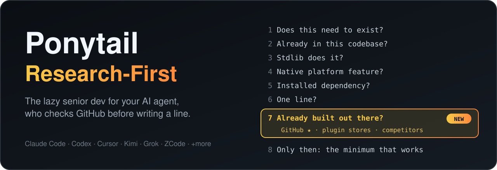

<p align="center">
  
</p>

<h1 align="center">Ponytail Research-First</h1>

<p align="center">
  <strong>Don't let your AI agent reinvent the wheel.</strong><br>
  The lazy senior dev for Claude Code, Codex, Cursor, Kimi, Grok and ZCode, who checks GitHub, plugin stores and competitors <em>before</em> writing a single line.
</p>

<p align="center">
  <a href="https://github.com/byensitmagnus/ponytail-research-first/stargazers"></a>
  <a href="https://github.com/byensitmagnus/ponytail-research-first/actions/workflows/test.yml"></a>
  
  
  
  <a href="https://github.com/DietrichGebert/ponytail"></a>
</p>

<p align="center">
  <a href="#install">Install</a> &middot;
  <a href="#real-example-b2b-wholesale-prices-on-woocommerce">Example</a> &middot;
  <a href="#where-it-looks">Where it looks</a> &middot;
  <a href="#commands">Commands</a> &middot;
  <a href="#faq">FAQ</a>
</p>

---

AI coding agents love to build. Ask for a B2B login with wholesale prices and you get a custom user role, a price table, a registration form and a checkout bug, while a WordPress plugin with **10,000+ active installs** already does it.

**Ponytail Research-First** is a drop-in fork of [Ponytail](https://github.com/DietrichGebert/ponytail), the lazy-senior-dev skill for AI agents, with one rung added to its ladder. Before building anything bigger than a function, the agent spends a few minutes looking where the answer most likely already exists:

- **GitHub**, ranked by stars
- **Plugin and app stores**: WordPress.org, WooCommerce, Shopify App Store, npm, PyPI
- **Competitors' shipped products**: the feature you want, already designed and battle-tested

Then it reads the code that does the work and picks the laziest safe option: **reuse** it, **adapt** it, or **steal the principle** and write a small version of its own.

> Lazy about writing. Never lazy about looking.

## The ladder, now with research

Before writing code, the agent stops at the first rung that holds:

```
1. Does this need to exist?     → no: skip it (YAGNI)
2. Already in this codebase?    → reuse it, don't rewrite
3. Stdlib does it?              → use it
4. Native platform feature?     → use it
5. Installed dependency?        → use it
6. One line?                    → one line
7. Already built out there?     → GitHub ★ · plugin stores · competitors      ← NEW
                                   reuse | adapt | inspired by | nothing fits
8. Only then: the minimum that works
```

Rung 7 only fires for feature-sized work (a feature, an integration, a subsystem) and is time-boxed to 3–5 searches. Bug fixes and one-liners never pay for it. Before the code, the agent leaves one line so you can see what it checked:

```
Research: b2bking-wholesale-for-woocommerce@5.2.60 (10k installs, 4.9★, GPL) → reuse
```

## Real example: B2B wholesale prices on WooCommerce

> "Build a B2B login where business customers sign up and see their own prices, separate from the B2C shop."

Without research, an agent hand-rolls a role system, per-customer price storage, a registration flow and cart hooks: code you now maintain forever.

With `/ponytail-research B2B wholesale prices, WooCommerce`:

| Candidate | Version | Signal | License | Fit |
|---|---|---|---|---|
| `b2bking-wholesale-for-woocommerce` | 5.2.60 | 10k active installs, 4.9★ (108 reviews), updated 2026-09-11 | GPL | free: customer groups, per-group prices, account approval. Premium: B2B registration forms |
| `woocommerce-wholesale-prices` | 2.2.9 | 20k active installs, 4.8★ (546 reviews), updated 2026-08-03 | GPL | wholesale prices per role |
| GitHub `woocommerce b2b` | — | best repo: 1★ | mixed | nothing maintained |

**Read:** B2BKing 5.2.60, `public/class-b2bking-public.php`. The group is user meta `b2bking_customergroup`; the price is product meta `b2bking_regular_product_price_group_<id>`, applied through the `woocommerce_product_get_price` filters and `woocommerce_before_calculate_totals`.
**Principle:** a group on the customer plus a per-group price on each product, swapped by WooCommerce's own price filters at render and in the cart, so the B2C shop stays untouched.
**Decision:** reuse B2BKing free for groups and per-group prices. Its B2B registration form is Premium: buy it, or let customers register normally and approve them into the B2B group in the free customer hub. **Next:** install on staging, create a wholesale group, price three products, test a B2C and a B2B login.

Stars and installs picked the candidates; reading the code and the feature list is what showed the registration form sits in the paid tier.

The search order mattered. GitHub had nothing above one star; the WordPress.org plugin directory had two mature options. That is why rung 7 checks the store that fits your stack, not just GitHub. On Shopify it would stop even earlier, at rung 4: check the plan's native B2B features first.

<sub>Signals pulled live from the WordPress.org plugin API, its public plugin SVN and `gh search repos` on 2026-09-25. Numbers move; the skill re-runs the search every time.</sub>

## Where it looks

| Where | How | Signal it's legit |
|---|---|---|
| GitHub | `gh search repos "<feature> <stack>" --sort stars`, `gh search code` | stars, a push this year, a license, tests |
| WordPress / WooCommerce | WordPress.org plugin API, then the plugin zip's PHP | active installs, rating, last update, "tested up to" |
| Shopify | native features for your plan, App Store, [github.com/Shopify](https://github.com/Shopify) | plan features, reviews, Built for Shopify |
| npm / PyPI | registry metadata | weekly downloads, last release, maintainers |
| Competitor products | what you can lawfully see as a user: UI and flows, page source, plugin zips, the config they write | data model, flow, UX (the principle, never the code) |

Stars pick the candidates; the code decides. The agent reads the files that implement the feature, checks what sits in a paid tier, and records the exact version, license and files it read.

## Never lazy about trust

- Copies code only when the license allows it, and keeps the attribution. Proprietary or unlicensed code teaches the principle; it is never pasted.
- Official download sources only. Nothing untrusted runs outside a sandbox; reading files needs no execution.
- Never bypasses licensing, DRM, obfuscation or a site's terms, and doesn't decompile or decrypt unless the license and the law clearly allow it.
- Treats every new dependency as a supply-chain decision: maintainer, exact name (typosquats), install scripts.
- Everything Ponytail already protects stays protected: input validation at trust boundaries, error handling that prevents data loss, security, accessibility.

## Install

`node` on your PATH is the only requirement for the hook-based installs. Already running upstream Ponytail? This fork keeps the same plugin id (`ponytail@ponytail`), so it replaces it instead of stacking a second copy.

### Claude Code

```
/plugin marketplace add byensitmagnus/ponytail-research-first
```
```
/plugin install ponytail@ponytail
```

Send them as two separate prompts. Coming from upstream: `/plugin marketplace remove ponytail` first.

### Codex (ChatGPT)

```bash
codex plugin marketplace add byensitmagnus/ponytail-research-first
codex plugin add ponytail@ponytail
```

Open `/hooks` in `codex`, trust the two lifecycle hooks, start a new thread. Covers the Codex desktop app too.

### Cursor

```bash
git clone https://github.com/byensitmagnus/ponytail-research-first
node ponytail-research-first/scripts/cursor-hooks.js install
```

Merges two native hooks into `~/.cursor/hooks.json` and keeps the hooks you already have. Details: [docs/cursor-hooks.md](docs/cursor-hooks.md).

### Grok Build

```bash
grok plugin install byensitmagnus/ponytail-research-first --trust
```

Enable it under `/plugins` or with `[plugins] enabled = ["ponytail"]` in `~/.grok/config.toml`.

### ZCode

New in this fork: ZCode's hook runner drops any stdout that isn't JSON, so the hooks now answer it with `hookSpecificOutput`. Add to `hooks.events` in `~/.zcode/cli/config.json`:

```json
"SessionStart": [{ "matcher": "startup|resume|clear|compact", "hooks": [
  { "type": "process", "command": "node", "args": ["/path/to/ponytail-research-first/hooks/ponytail-activate.js"], "timeoutMs": 10000 }
]}]
```

### Kimi Code

Kimi CLI's hooks can't inject context (its `SessionStart` output is discarded, `UserPromptSubmit` can only block), so Kimi gets the skills: link or copy `skills/*` into `~/.kimi/skills/`. Kimi then picks `ponytail` and `ponytail-research` by their descriptions.

### Everything else

Gemini CLI, OpenCode, GitHub Copilot, pi, Hermes, Qoder, Devin, Swival, OpenClaw, Windsurf, Cline, Kiro, Zed, Amp, Jules: same adapters as upstream. Take any command from the [upstream install guide](https://github.com/DietrichGebert/ponytail#install) and swap `DietrichGebert/ponytail` for `byensitmagnus/ponytail-research-first`. The npm package (`@dietrichgebert/ponytail`, used by OpenCode) is upstream's; for this fork point OpenCode at a checkout: `{ "plugin": ["/path/to/ponytail-research-first/.opencode/plugins/ponytail.mjs"] }`. Instruction-only hosts read [`AGENTS.md`](AGENTS.md), which carries rung 7. File map: [docs/agent-portability.md](docs/agent-portability.md).

## Commands

| Command | What it does |
|---------|--------------|
| `/ponytail-research <feature>` | **New.** Research-first: GitHub by stars, plugin stores, competitors → a scored table and a reuse / adapt / inspired-by / build decision. |
| `/ponytail [lite \| full \| ultra \| off]` | Set the intensity, or turn it off. |
| `/ponytail-review` | Review the current diff for over-engineering, returns a delete-list. |
| `/ponytail-audit` | Audit the whole repo for over-engineering. |
| `/ponytail-debt` | Harvest deferred `ponytail:` shortcuts into a ledger. |
| `/ponytail-gain` | Measured-impact scoreboard from the upstream benchmark. |
| `/ponytail-help` | Quick reference. |

In Codex, invoke skills with `@` (`@ponytail-research`). Set the default level with `PONYTAIL_DEFAULT_MODE` (`lite`/`full`/`ultra`/`off`) or `defaultMode` in `~/.config/ponytail/config.json` (`%APPDATA%\ponytail\config.json` on Windows).

## What this fork changes

| Change | Where |
|---|---|
| Rung 7 "Already built out there?" and the *Research first* section | [`skills/ponytail/SKILL.md`](skills/ponytail/SKILL.md), [`AGENTS.md`](AGENTS.md) and every rule copy |
| New `/ponytail-research` skill with the full workflow | [`skills/ponytail-research/SKILL.md`](skills/ponytail-research/SKILL.md) |
| ZCode hook support (JSON output, own state flag) | [`hooks/ponytail-runtime.js`](hooks/ponytail-runtime.js), [`tests/zcode-hooks.test.js`](tests/zcode-hooks.test.js) |
| Drift guard: the research rule can't silently vanish from a copy | [`scripts/check-rule-copies.js`](scripts/check-rule-copies.js) |

Everything else is upstream Ponytail, merged from `DietrichGebert/ponytail` as it moves.

## Numbers

Upstream Ponytail measured **~54% less code, ~20% lower cost, ~27% faster, 100% safe** on real Claude Code sessions editing a FastAPI + React repo ([writeup](benchmarks/results/2026-06-18-agentic.md), [reproduce](benchmarks/)). Those numbers belong to the upstream ruleset. Rung 7 is not benchmarked yet: it adds a short search to feature-sized tasks and aims to delete whole subsystems, not lines. A research-arm benchmark is the next thing to add; until then, treat it as a hypothesis with a good example. The hooks put the rule in front of the agent; they don't prove the research happened. The one-line `Research:` note before the code is what makes it checkable.

## FAQ

**Does research make my agent slower?**
Only on feature-sized work, and only for 3–5 searches. A plugin you install in ten minutes beats a subsystem you debug for a week.

**Is studying competitors legal?**
The agent studies what you can lawfully see as a user: the UI and flows, page source, docs, code shipped as plain source, and the config a program writes. In the EU a lawful user may observe, study and test a program while running it ([Directive 2009/24/EC](https://eur-lex.europa.eu/eli/dir/2009/24/oj/eng), Art. 5(3)); decompiling is allowed only for interoperability under Art. 6, and elsewhere a license can forbid more. So the rules never assume decompiling or decrypting is allowed, and never paste proprietary code: it teaches the principle, the agent writes its own. Not legal advice.

**Why does it check WordPress.org before GitHub for WooCommerce?**
Because that's where WooCommerce solutions live. Rung 7 searches where the answer most likely exists for your stack.

**Does it work with [caveman](https://github.com/JuliusBrussee/caveman)?**
Yes. Caveman shrinks what the agent says; Ponytail shrinks what it builds.

**Why a fork and not a PR?**
Research-first changes the ladder itself, which is upstream's call to make. The fork lets you use it today and keeps pulling upstream improvements.

## Credits

Built on [Ponytail](https://github.com/DietrichGebert/ponytail) by [Dietrich Gebert](https://github.com/DietrichGebert): the ladder, the hooks, the adapters and the benchmark are his. Translations of the upstream README: [Español](README.es.md) &middot; [한국어](README.ko.md).

## License

[MIT](LICENSE), same as upstream.

## Star History

<a href="https://www.star-history.com/#byensitmagnus/ponytail-research-first&Date">
 <picture>
   <source media="(prefers-color-scheme: dark)" srcset="https://api.star-history.com/svg?repos=byensitmagnus/ponytail-research-first&type=Date&theme=dark" />
   <source media="(prefers-color-scheme: light)" srcset="https://api.star-history.com/svg?repos=byensitmagnus/ponytail-research-first&type=Date" />
   
 </picture>
</a>
